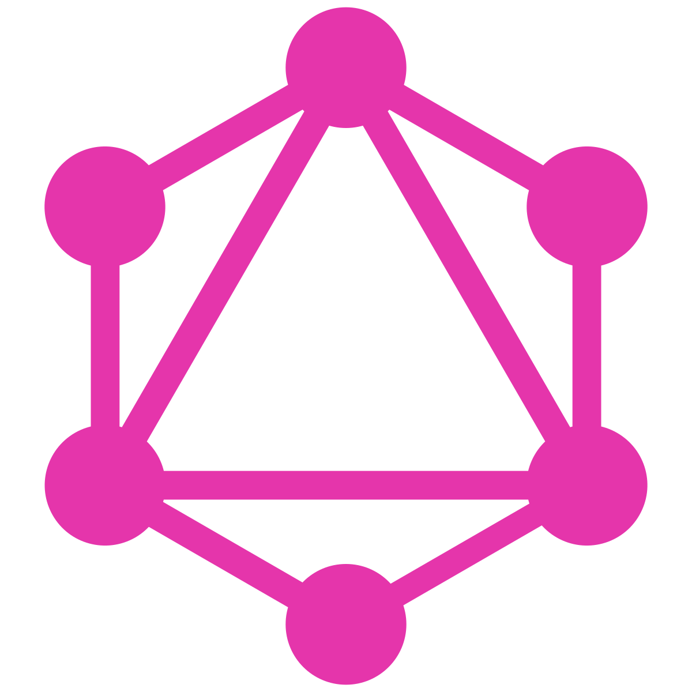

### 📣🎯Hi there 👋 Thanks for visiting my profile ✨

I wish you good luck in the process of visiting my profile.

  
   
    
  

## ⚡ Technologies

<table style="width: 100%;">
  <tr style="width: 100%;">
    <td align="center" width="96">
      

        
        
HTML5

      

    </td>
    <td align="center" width="96">
      

        
        
CSS3

      

    </td>
    <td align="center" width="96">
      

      
        
SAAS

      

    </td>
    <td align="center" width="96">
      

      
        
TailwindCSS

      

    </td>
    <td align="center" width="96">
      

      
        
Javascript

      

    </td>
    <td align="center" width="96">
      

      
        
Typescript

      

    </td>
    <td align="center" width="96">
      

      
        
PHP

      

    </td>
    <td align="center" width="96">
      

      
        
Laravel

      

    </td>
    <td align="center" width="96">
      

      
        
WordPress

      

    </td>
  </tr>
  <tr style="width: 100%;">
    <td align="center" width="96">
      

      
        
React

      

    </td>
    <td align="center" width="96">
      

      
        
Redux

      

    </td>
    <td align="center" width="96">
      

      
        
React Native

      

    </td>
    <td align="center" width="96">
      

      
        
NextJS

      

    </td>
    <td align="center" width="96">
      

      
        
Vue

      

    </td>
    <td align="center" width="96">
      

      
        
NuxtJS

      

    </td>
    <td align="center" width="96">
      

      
        
Angular

      

    </td>
    <td align="center" width="96">
      

      
        
Shopify

      

    </td>
    <td align="center" width="96">
      

      
        
Node

      

    </td>
  </tr>
  <tr style="width: 100%;">
    <td align="center" width="96">
      

        
        
MySQL

      

    </td>
    <td align="center" width="96">
      

        
        
Postgresql

      

    </td>
    <td align="center" width="96">
      

        
        
GraphQL

      

    </td>
    <td align="center" width="96">
      

        
        
Express

      

    </td>
    <td align="center" width="96">
      

        
        
MongoDB

      

    </td>
    <td align="center" width="96">
      

        
        
AWS

      

    </td>
    <td align="center" width="96">
      

        
        
Python

      

    </td>
    <td align="center" width="96">
      

        
        
BlockChain

      

    </td>
    <td align="center" width="96">
      

        
        
Web3

      

    </td>
  </tr>
</table>

###

Here are some ideas to get you started:

- 🔭 I’m currently working on ...
- 🌱 I’m currently learning ...
- 👯 I’m looking to collaborate on ...
- 🤔 I’m looking for help with ...
- 💬 Ask me about ...
- 📫 How to reach me: ...
- 😄 Pronouns: ...
- ⚡ Fun fact: ...
